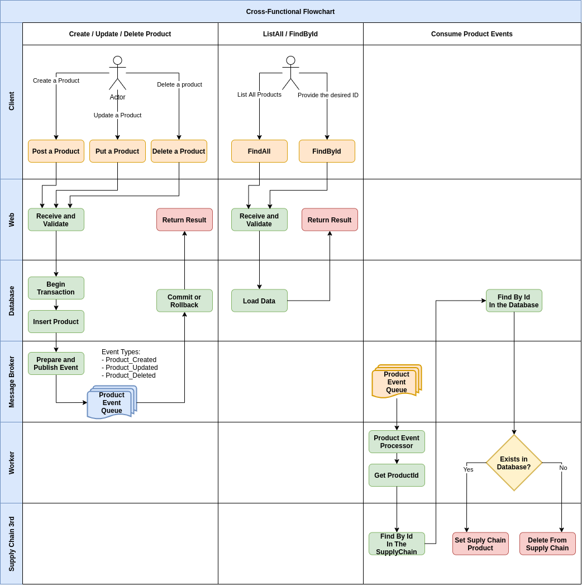

# product-catalog-backend

Product Catalog Backend application for Philips assignment test.

## Implementation Details

### Assumptions
For this implementation it was assumed that:
1. The Products should be primarily stored in a dedicated database and synchronized with the SupplyChain as soon as possible;
2. There was no need to import all SupplyChain products, once they host products from other clients too; 
3. The application should be robust, yet simple to be understood, maintained and enhanced; 

### Implementation Highlights
Among the features implemented, it's important to highlight that:
1. The database layer relies on an embedded postgres instance and can be easily ported to a dedicated instance or even to another database provider; 
2. The SupplyChain notification goes through a Producer/Consumer mechanism, initially based on an embedded ActiveMQ message broker, but can be tweaked by implementing the proper interfaces; 
3. It was added integration tests to cover most of the man functionalities; 
4. A JaCoCo plugin is also in place to provide test coverage metrics;
5. The process of persisting the data and posting the notification in the queue happens inside a transaction. If the notification fails, the database change is rolled back.

### General Flow Overview
An overview diagram:


### Future Enhancements
As a highlight for future enhancements could be:
1. Add more test scenarios to cover a wider range of possible inputs, testing each component individually;
2. Isolate the "core" package in a shared module, as well as the "web" and "worker" packages that could be isolated instances sharing the same core module;
3. Prepare an application instance and trigger a load test against it, according to the expected peak usage volume;
4. Configure a CI/CD environment to make the build and deployment process easier;
5. Depending on the future usage of this application there a couple refactorings could be interesting:
   1. Remove the ProductService's @Transactional. This transaction holds the database connection too long, affecting the performance and reducing the number of databases that the application can support. If a clever mechanism for coordinating the persistence and the notification was put in place maybe it wouldn't be necessary to hold a transaction;
   2. Check in the requirements if the local Product consistency really needs to be strong. If it was possible to be eventually consistent, then the entire process (persistence and notification) could happen through queues, even if some L1 cache (Redis, for instance) become necessary for some realtime check/response until the message get processed;
   3. This project aspects could fit very well in a Domain Driven Design, where the data changes happen through events by nature. Although the code could become a little more verbose, it would be way easier to be extended, exported and reused.
   
## Build and Run

### Requirements

This application is build based on [JDK 8](https://www.oracle.com/br/java/technologies/javase/javase-jdk8-downloads.html) so
it will be required to be in your classpath.

### Running the application locally

If you have maven installed and under linux/mac:

    mvn spring-boot:run -pl application

If maven is not installed, but still under linux/mac

    mvnw spring-boot:run -pl application

And for windows without gradle

    mvnw.cmd spring-boot:run -pl application

After the server is running, go to

```
http://localhost:8080/swagger-ui/#/product-controller
```
The API's swagger documentation will lead you to the available services.
